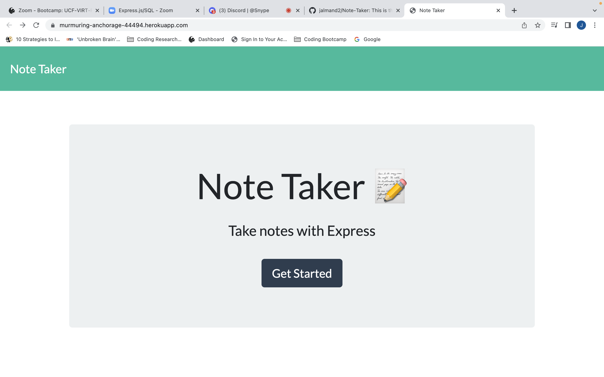
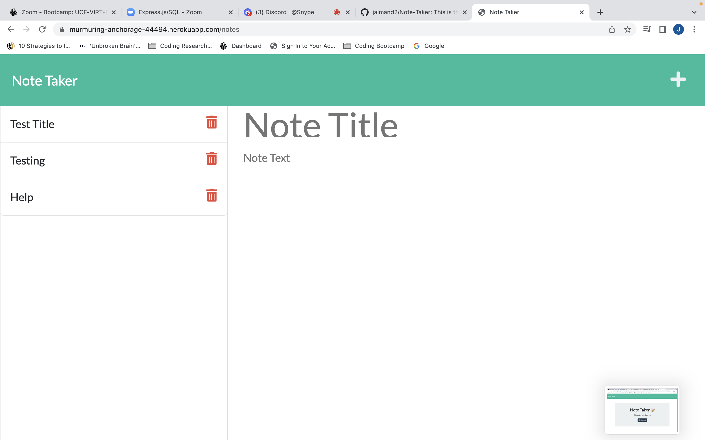

# Note Taker 

## Description

This application requires us to connect the front end to the back end and deploy the application to Heroku. We are provided with the front end code for a Note Taking application and have to create the back end using Express.js. In the development of this application I learned to save and retrieve notes from a JSON file.

## Table of Contents (Optional)

If your README is long, add a table of contents to make it easy for users to find what they need.

## Usage

[Note-Taker Deployed Application](https://murmuring-anchorage-44494.herokuapp.com/)